# Diagrama ER - Proyecto Inmotika

> **Convenciones**: `PK` = Primary Key (UUID), `FK` = Foreign Key, `timestamptz` = timestamp with timezone.
> Todas las entidades incluyen `created_at` y `updated_at` para auditoría.
> La autenticación se delega a **Supabase Auth** (`auth.users`). La tabla `PERFIL_USUARIO` extiende los datos del usuario autenticado.

```mermaid
erDiagram

    %% ══════════════════════════════════════════
    %% CATALOGOS (Diccionarios de Estados)
    %% ══════════════════════════════════════════

    CATALOGO_ESTADO_GENERAL {
        uuid id PK
        string codigo
        string nombre
        string descripcion
        boolean activo
    }

    CATALOGO_ESTADO_VISITA {
        uuid id PK
        string codigo
        string nombre
        string descripcion
        boolean activo
    }

    CATALOGO_ESTADO_INTERVENCION {
        uuid id PK
        string codigo
        string nombre
        string descripcion
        boolean activo
    }

    CATALOGO_ESTADO_EJECUCION_PASO {
        uuid id PK
        string codigo
        string nombre
        string descripcion
        boolean activo
    }

    CATALOGO_TIPO_VISITA {
        uuid id PK
        string codigo
        string nombre "preventiva, correctiva, instalacion"
        string descripcion
        boolean activo
    }

    %% ══════════════════════════════════════════
    %% IDENTIDAD Y ROLES
    %% ══════════════════════════════════════════

    PERFIL_USUARIO {
        uuid id PK "ref: auth.users.id"
        string nombre_completo
        string telefono
        string avatar_url
        string rol
        uuid estado_id FK
        timestamptz created_at
        timestamptz updated_at
    }

    DIRECTOR {
        uuid id PK
        uuid usuario_id FK "PERFIL_USUARIO.id"
        uuid estado_id FK
        timestamptz created_at
        timestamptz updated_at
    }

    COORDINADOR {
        uuid id PK
        uuid usuario_id FK "PERFIL_USUARIO.id"
        uuid director_id FK "DIRECTOR.id"
        uuid estado_id FK
        timestamptz created_at
        timestamptz updated_at
    }

    TECNICO {
        uuid id PK
        uuid usuario_id FK "PERFIL_USUARIO.id"
        string tipo_documento
        string identificacion
        string documento_cedula_url
        string planilla_seg_social_url
        string certificados
        uuid estado_id FK
        timestamptz created_at
        timestamptz updated_at
    }

    DISPONIBILIDAD_TECNICO {
        uuid id PK
        uuid tecnico_id FK
        timestamptz fecha_inicio
        timestamptz fecha_fin
        string motivo
        timestamptz created_at
        timestamptz updated_at
    }

    %% ══════════════════════════════════════════
    %% ESTRUCTURA DE CLIENTES
    %% ══════════════════════════════════════════

    CLIENTE {
        uuid id PK
        string razon_social
        string nit
        string dv
        string tipo_persona
        string celular
        string email
        string logo_url
        string rut_url
        date fecha_nacimiento "Si es persona natural"
        uuid estado_id FK
        timestamptz created_at
        timestamptz updated_at
    }

    SUCURSAL {
        uuid id PK
        uuid cliente_id FK
        boolean es_principal
        string nombre
        string direccion
        string ciudad
        string estado_depto
        string pais
        string clasificacion
        string horarios_atencion
        uuid estado_id FK
        timestamptz created_at
        timestamptz updated_at
    }

    CONTACTO {
        uuid id PK
        uuid cliente_id FK "RLS: acceso directo"
        string identificacion
        string nombre
        string genero
        string cargo
        string area_departamento
        string email
        string telefono_movil
        string telefono_oficina
        date fecha_nacimiento
        date fecha_matrimonio
        uuid estado_id FK
        timestamptz created_at
        timestamptz updated_at
    }

    CONTRATO {
        uuid id PK
        uuid sucursal_id FK
        uuid cliente_id FK "RLS: acceso directo"
        string numero_contrato
        date fecha_inicio
        date fecha_fin
        string documento_url
        uuid estado_id FK
        timestamptz created_at
        timestamptz updated_at
    }

    %% ══════════════════════════════════════════
    %% DISPOSITIVOS Y CATEGORIZACION
    %% ══════════════════════════════════════════

    CATEGORIA_DISPOSITIVO {
        uuid id PK
        string nombre
        string descripcion
        string marca
        string modelo
        timestamptz created_at
        timestamptz updated_at
    }

    DISPOSITIVO {
        uuid id PK
        uuid sucursal_id FK
        uuid categoria_id FK
        uuid cliente_id FK "RLS: acceso directo"
        string propiedad_de "cliente o inmotika"
        string id_inmotika
        string id_cliente_interno "Asignado por el cliente"
        string codigo_unico
        string serial
        string proveedor
        int frecuencia_mantenimiento_meses "Para ciclo automatico"
        date fecha_proximo_mantenimiento "Calculada tras cada preventivo"
        uuid estado_id FK
        timestamptz created_at
        timestamptz updated_at
    }

    HISTORIAL_TRASLADO {
        uuid id PK
        uuid dispositivo_id FK
        uuid sucursal_origen_id FK
        uuid sucursal_destino_id FK
        timestamptz fecha_traslado
        string motivo
        uuid usuario_id FK "Quien lo realizo"
        timestamptz created_at
    }

    PASO_PROTOCOLO {
        uuid id PK
        uuid categoria_id FK "CATEGORIA_DISPOSITIVO.id"
        string descripcion
        int orden
        boolean es_obligatorio
        timestamptz created_at
        timestamptz updated_at
    }

    %% ══════════════════════════════════════════
    %% OPERACIONES (VISITAS)
    %% ══════════════════════════════════════════

    SOLICITUD_VISITA {
        uuid id PK
        uuid cliente_id FK
        uuid sucursal_id FK
        uuid coordinador_id FK
        uuid creado_por FK "PERFIL_USUARIO.id (null = Auto-Sistema)"
        uuid tipo_visita_id FK "CATALOGO_TIPO_VISITA"
        timestamptz fecha_solicitud
        string motivo
        uuid estado_id FK "CATALOGO_ESTADO_VISITA"
        timestamptz created_at
        timestamptz updated_at
    }

    VISITA {
        uuid id PK
        uuid solicitud_id FK
        uuid coordinador_id FK
        uuid cliente_id FK "RLS: acceso directo"
        uuid sucursal_id FK "RLS: acceso directo"
        uuid tipo_visita_id FK "CATALOGO_TIPO_VISITA"
        timestamptz fecha_programada
        timestamptz fecha_inicio
        timestamptz fecha_fin
        text observaciones
        uuid estado_id FK "CATALOGO_ESTADO_VISITA"
        timestamptz created_at
        timestamptz updated_at
    }

    EVIDENCIA_VISITA {
        uuid id PK
        uuid visita_id FK
        string url
        string descripcion
        timestamptz created_at
    }

    INTERVENCION {
        uuid id PK
        uuid visita_id FK
        uuid dispositivo_id FK
        text hallazgos
        text acciones_realizadas
        uuid estado_id FK "CATALOGO_ESTADO_INTERVENCION"
        timestamptz created_at
        timestamptz updated_at
    }

    EJECUCION_PASO {
        uuid id PK
        uuid intervencion_id FK
        uuid paso_protocolo_id FK
        timestamptz fecha_inicio
        timestamptz fecha_fin
        text comentarios
        uuid estado_id FK "CATALOGO_ESTADO_EJECUCION_PASO"
        timestamptz created_at
        timestamptz updated_at
    }

    EVIDENCIA_PASO {
        uuid id PK
        uuid ejecucion_paso_id FK
        string url
        string tipo "antes, durante, despues"
        string descripcion
        timestamptz created_at
    }

    %% ══════════════════════════════════════════
    %% TABLAS INTERMEDIAS (PIVOTE M:N)
    %% ══════════════════════════════════════════

    CONTACTO_SUCURSAL {
        uuid id PK
        uuid contacto_id FK
        uuid sucursal_id FK
        timestamptz created_at
    }

    VISITA_TECNICO {
        uuid id PK
        uuid visita_id FK
        uuid tecnico_id FK
        boolean es_lider
        timestamptz created_at
    }

    %% ══════════════════════════════════════════
    %% RELACIONES
    %% ══════════════════════════════════════════

    %% Identidad y Supervision
    PERFIL_USUARIO ||--o| DIRECTOR : "rol"
    PERFIL_USUARIO ||--o| COORDINADOR : "rol"
    PERFIL_USUARIO ||--o| TECNICO : "rol"
    DIRECTOR ||--o{ COORDINADOR : "supervisa"

    %% Estructura de Clientes
    CLIENTE ||--o{ SUCURSAL : "posee"
    SUCURSAL ||--o{ CONTRATO : "tiene"
    SUCURSAL ||--o{ DISPOSITIVO : "contiene"
    CLIENTE ||--o{ CONTACTO : "pertenece a"

    %% Contactos M:N
    CONTACTO ||--o{ CONTACTO_SUCURSAL : ""
    SUCURSAL ||--o{ CONTACTO_SUCURSAL : ""

    %% Dispositivos y Protocolo
    CATEGORIA_DISPOSITIVO ||--o{ DISPOSITIVO : "clasifica"
    CATEGORIA_DISPOSITIVO ||--o{ PASO_PROTOCOLO : "define protocolo"

    %% Flujo de Visitas
    SOLICITUD_VISITA }|--|| CLIENTE : "solicitada por"
    SOLICITUD_VISITA }|--|| SUCURSAL : "dirigida a"
    SOLICITUD_VISITA }|--|| COORDINADOR : "gestionada por"
    PERFIL_USUARIO ||--o{ SOLICITUD_VISITA : "creada por"

    VISITA }|--|| SOLICITUD_VISITA : "corresponde a"
    VISITA }|--|| COORDINADOR : "aprobada por"
    VISITA ||--o{ EVIDENCIA_VISITA : "adjunta fotos a observaciones"

    %% Tecnicos M:N
    VISITA ||--o{ VISITA_TECNICO : ""
    TECNICO ||--o{ VISITA_TECNICO : ""

    %% Intervenciones y Ejecucion
    VISITA ||--|{ INTERVENCION : "consiste de"
    INTERVENCION ||--|| DISPOSITIVO : "sobre"
    INTERVENCION ||--o{ EJECUCION_PASO : "registra"
    EJECUCION_PASO ||--o{ EVIDENCIA_PASO : "contiene"
    EJECUCION_PASO }|--|| PASO_PROTOCOLO : "instancia de"

    %% Otros
    DISPOSITIVO ||--o{ HISTORIAL_TRASLADO : "registra"
    TECNICO ||--o{ DISPONIBILIDAD_TECNICO : "tiene"

    %% Catalogos
    CATALOGO_ESTADO_GENERAL ||--o{ PERFIL_USUARIO : ""
    CATALOGO_ESTADO_GENERAL ||--o{ DIRECTOR : ""
    CATALOGO_ESTADO_GENERAL ||--o{ TECNICO : ""
    CATALOGO_ESTADO_GENERAL ||--o{ COORDINADOR : ""
    CATALOGO_ESTADO_GENERAL ||--o{ CLIENTE : ""
    CATALOGO_ESTADO_GENERAL ||--o{ SUCURSAL : ""
    CATALOGO_ESTADO_GENERAL ||--o{ CONTACTO : ""
    CATALOGO_ESTADO_GENERAL ||--o{ CONTRATO : ""
    CATALOGO_ESTADO_GENERAL ||--o{ DISPOSITIVO : ""
    CATALOGO_ESTADO_VISITA ||--o{ SOLICITUD_VISITA : ""
    CATALOGO_ESTADO_VISITA ||--o{ VISITA : ""
    CATALOGO_TIPO_VISITA ||--o{ SOLICITUD_VISITA : ""
    CATALOGO_TIPO_VISITA ||--o{ VISITA : ""
    CATALOGO_ESTADO_INTERVENCION ||--o{ INTERVENCION : ""
    CATALOGO_ESTADO_EJECUCION_PASO ||--o{ EJECUCION_PASO : ""
```

> [!NOTE]
> **Integridad (Índices Únicos Compuestos a implementar en DDL)**:
> - `CONTACTO_SUCURSAL`: Unique index en `(contacto_id, sucursal_id)`.
> - `VISITA_TECNICO`: Unique index en `(visita_id, tecnico_id)`.
> - `CATEGORIA_DISPOSITIVO`: Unique index en `(nombre, marca, modelo)`.
> - `PASO_PROTOCOLO`: Unique index en `(categoria_id, orden)`.